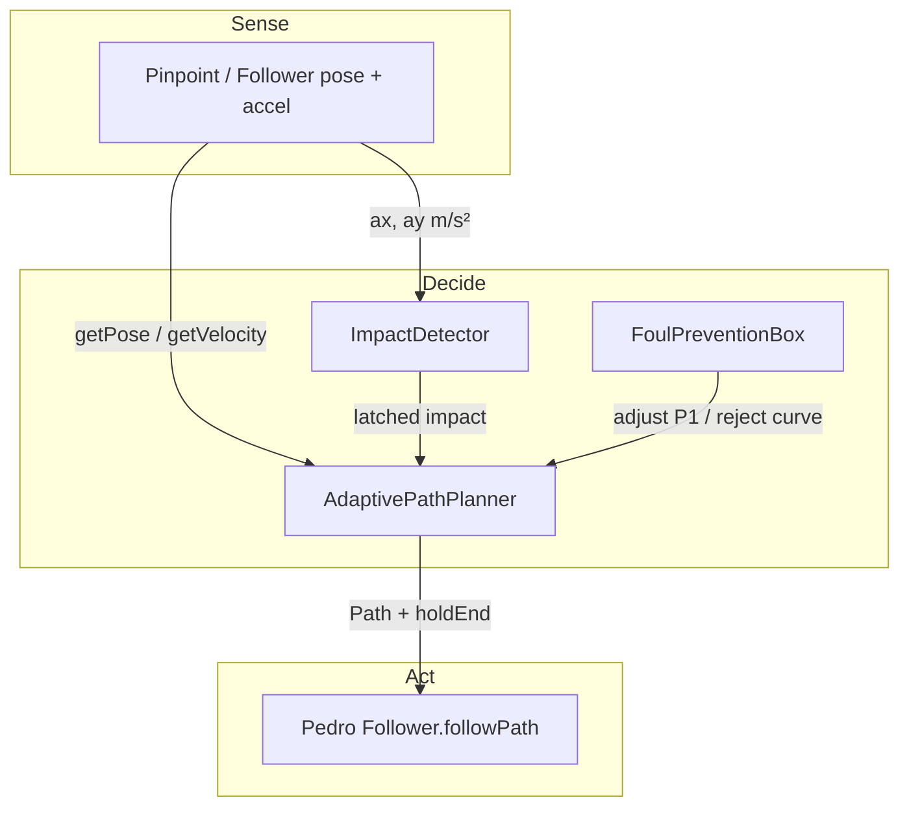

# Architecture overview

AACS is three decoupled Java types plus a Pedro `Follower`. Nothing in `adaptive/` talks to motors directly. Hardware and Bézier execution stay in Pedro; AACS only **senses**, **decides**, and **swaps the path**.

## Why latch + cooldown

`ImpactDetector` **latches** so a 10 ms spike is not missed by a 20 ms loop. `AdaptivePathPlanner.update()` **consumes** that latch (`resetImpactState()`) exactly once. A **300 ms** cooldown then drops extra latches so a robot sitting on you cannot rebuild the path at 50 Hz.

If the planner is **disabled** or `targetPose` is **null**, latches are still consumed. That prevents a stale hit from firing the instant you re-enable planning.

## Allocation rules

| Call | Allocates? |
| --- | --- |
| `ImpactDetector.update` | No — primitives only |
| `FoulPreventionBox` queries | No — zones preallocated in `init` |
| `AdaptivePathPlanner.update` idle | No |
| Accepted replan | Yes — Pedro `BezierCurve` / `Path` (immutable; cannot recycle) |

Next: each class in detail, starting with [ImpactDetector](./impact-detector.mdx).
