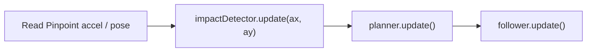

# Autonomous Adaptive Control System

**AACS** (Autonomous Adaptive Control System) sits on top of [Pedro Pathing](https://pedropathing.com) and the goBILDA **Pinpoint** odometry computer. When another robot shoves you in autonomous, AACS does not freeze: it detects the impact, builds a new quadratic Bézier from the live pose to the current goal, and injects it into Pedro’s `Follower` on the same OpMode cycle.

The Java lives in `org.firstinspires.ftc.teamcode.adaptive` inside this repository ([aqqusr/aacs](https://github.com/aqqusr/aacs)).

## Modules

| Class | Job |
| --- | --- |
| [`ImpactDetector`](../architecture/impact-detector.mdx) | Latch a collision from horizontal accel `A_ext = sqrt(ax² + ay²)` |
| [`AdaptivePathPlanner`](../architecture/adaptive-path-planner.mdx) | `P0 → P1 → P2` recovery path + cooldown |
| [`FoulPreventionBox`](../architecture/foul-prevention-box.mdx) | Field + Alliance/opponent geofence |
| [`AdaptiveTestOpMode`](../setup/opmode-integration.mdx) | TeleOp that wires the full pipeline |

## Loop contract

Do not reorder these four steps. The planner must swap the path **before** `follower.update()` so the new curve is driven on the same cycle.

:::note Units
`ImpactDetector` expects **m/s²**. Pedro `Follower.getAcceleration()` is **inches/s²**. Multiply by `0.0254`.
:::

## Default numbers

These are the values shipped in code — not FTC rules. Tune on your chassis.

- Impact threshold: **1.5 g** (~14.71 m/s²), sustain **50 ms**
- Replan cooldown: **300 ms**
- Pinpoint offsets: **−120 mm** strafe X, **−150 mm** forward Y
- Geofence clearance in the test OpMode: **6 in**

Next: [Prerequisites](./prerequisites.mdx) then [Installation](./installation.mdx).
