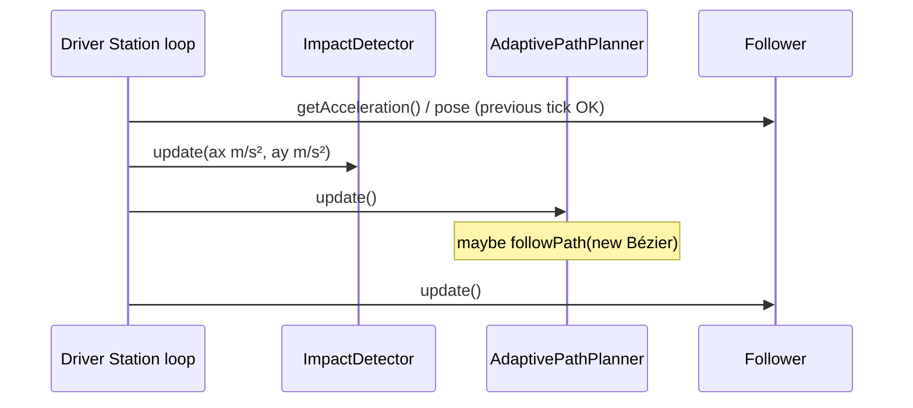

# OpMode integration

## Required loop order



```java
Vector accelInches = follower.getAcceleration();
double ax = accelInches.getXComponent() * 0.0254;
double ay = accelInches.getYComponent() * 0.0254;

impactDetector.update(ax, ay);
planner.update();
follower.update();
```

## Minimal Auto sketch

```java
Follower follower = Constants.createFollower(hardwareMap);
follower.setStartingPose(startPose);

ImpactDetector impactDetector = new ImpactDetector();
FoulPreventionBox geofence = new FoulPreventionBox();
geofence.setFieldBounds(0, 0, 144, 144);
geofence.setClearanceInches(6);
geofence.addAabb("opponent_wing", 0, 0, 24, 48);

AdaptivePathPlanner planner = new AdaptivePathPlanner(follower, impactDetector);
planner.setFoulPreventionBox(geofence);
planner.setTargetPose(scorePose);

follower.followPath(yourInitialPath, true);
```

Whenever Auto changes goals (intake → score → park):

```java
planner.setTargetPose(nextPose);
```

## AdaptiveTestOpMode

TeleOp name: **Adaptive Pipeline Test** (`Adaptive` group). Start pose `(36, 24, 0°)`.

| Gamepad 1 | Action |
| --- | --- |
| **A** (rising) | `setTargetPose(Alpha)` and `followPath` straight to Alpha `(108, 36, 0°)` |
| **B** (rising) | `setTargetPose(Beta)` `(108, 108, 90°)` — no new path |
| **X** (rising) | `planner.forceReplan()` |

Sample geofence: opponent wing `(0,0)–(24,48)` and submersible `(54,54)–(90,90)`, **6 in** clearance.

Source: `TeamCode/.../adaptive/AdaptiveTestOpMode.java`.
